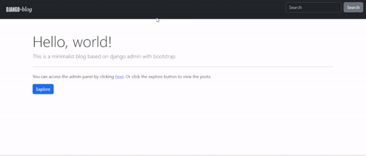

<p align="center">
  
</p>

This is a minimalistic blog built using Django Admin for content management and Bootstrap for styling.

## Features

- User-friendly Django Admin interface for managing blog content.
- Bootstrap for a clean and responsive design.
- Simple and lightweight structure for easy customization.

<p align="center">
  
</p>

## Getting Started

### Prerequisites

- Python (3.6 or higher)
- Django (3.x)
- Bootstrap (5.x)

### Installation

1. Clone the repository:

    ```
    git clone https://github.com/roderiano/django-blog.git
    ```

2. Create and activate a virtual environment:

    ```
    python -m venv venv
    ```

3. Install dependencies:

    ```
    pip install -r requirements.txt
    ```

4. Configure environment variables:
    Copy the `.env-sample` file to a new file called `.env`. Open the `.env` file and replace the values with your own.


5. Apply migrations:

    ```
    python manage.py migrate
    ```

6. Create a superuser for accessing the Django Admin:

    ```
    python manage.py createsuperuser
    ```

7. Run the development server:

    ```
    python manage.py runserver
    ```

8. Open your browser and navigate to [http://127.0.0.1:8000/admin/](http://127.0.0.1:8000/admin/) to log in and start managing your blog content.


### Running Tests

To run the tests, use the following command:

```
python manage.py test
```

## Customization

This project provides easy customization of the visual style through custom CSS variables at 'static/css/style.css'. Here's how you can personalize the appearance of your blog:

### Customizable CSS Variables

```css
:root {
    --custom-primary: #3498db;     /* Replace with your preferred primary color */
    --custom-secondary: #777777;   /* Replace with your preferred secondary color */
    --custom-body-color: #fff;      /* Replace with your preferred background color */
    --custom-main-color: #000000;   /* Replace with your preferred main text color */
    --custom-navbar-color: #303030; /* Replace with your preferred navigation bar color */
}

.btn-primary {
    background-color: var(--custom-primary);
    border-color: var(--custom-primary);
    color: #fff;
}

.btn-secondary {
    background-color: var(--custom-secondary);
    border-color: var(--custom-secondary);
    color: #fff;
}

.navbar {
    background-color: var(--custom-navbar-color);
}

body {
    color: var(--custom-main-color);
    background-color: var(--custom-body-color);
}
```
Feel free to experiment and tailor these variables to match your desired design aesthetic.

## Usage

1. Access the Django Admin interface to create, edit, and delete blog posts.
2. Customize the Bootstrap templates in the `templates` directory to modify the appearance of your blog.
3. Extend the functionality by adding additional Django apps, models, or views as needed.

## Contributing

Contributions are welcome! If you have suggestions, bug reports, or want to discuss new features, please open an issue to start a discussion.

For implementing new features or fixing bugs:

1. Fork the repository.

2. Create a new branch from the `develop` branch:

    ```bash
    git checkout -b feature/your-feature-name
    ```

3. Make your changes and ensure the code follows the project's coding standards.

4. Test your changes thoroughly.

5. Commit your changes:

    ```bash
    git commit -m "Add your concise and meaningful commit message"
    ```

6. Push your branch to your fork:

    ```bash
    git push origin feature/your-feature-name
    ```

7. Open a pull request against the `develop` branch, describing your changes and referencing the related issue.

8. Your pull request will be reviewed, and once approved, it will be merged.

Thank you for contributing to DevReport!

## License

This project is licensed under the [MIT License](LICENSE).

## Acknowledgments

- [Django](https://www.djangoproject.com/)
- [Bootstrap](https://getbootstrap.com/)
- [Font Awesome](https://fontawesome.com/)
